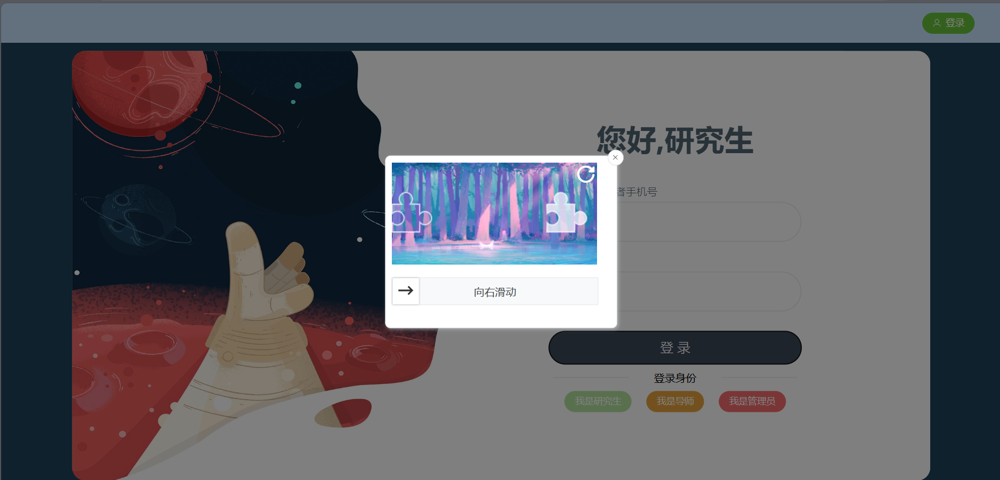
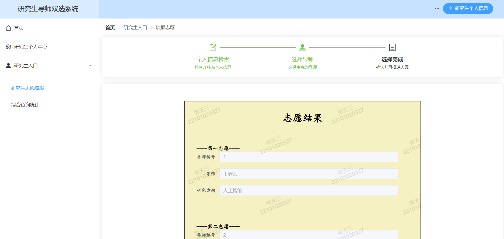
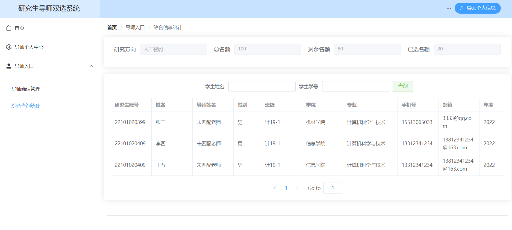
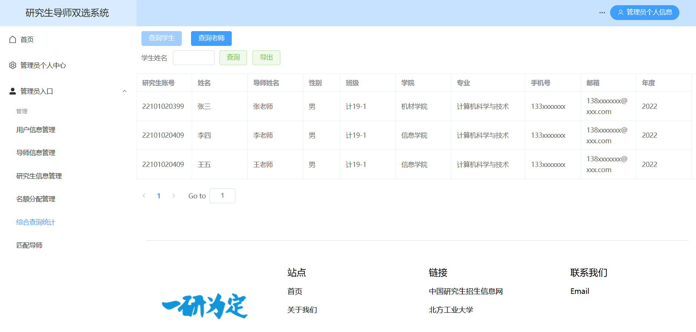
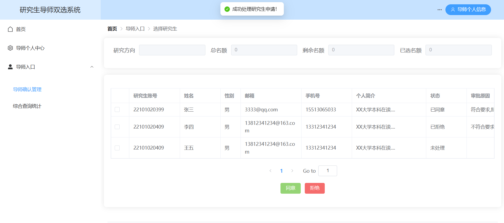
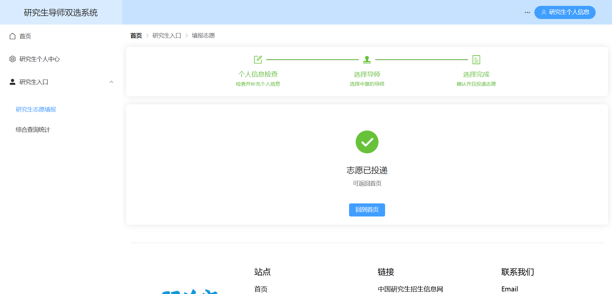

# 研究生导师双选平台 (Postgraduate Supervisor Mutual Selection Platform)

## 项目简介

这是一个基于Vue 3开发的研究生导师双选平台前端系统，旨在为研究生和导师提供一个便捷的双向选择平台。系统支持研究生志愿填报、导师申请处理、管理员统一管理等功能，实现了完整的双选流程管理。

## 功能特性

### 🔐 用户认证系统
- **多角色登录**：支持研究生、导师、管理员三种角色登录
- **滑块验证**：集成滑块验证组件，提升安全性
- **JWT认证**：基于JWT的用户认证和权限管理
- **路由守卫**：自动验证用户登录状态，保护需要认证的页面

### 👨‍🎓 研究生功能
- **个人信息管理**：查看和编辑个人资料
- **志愿填报**：选择心仪的导师并提交申请
- **申请查询**：查看志愿投递状态和结果
- **导师查询**：浏览导师信息和研究方向

### 👨‍🏫 导师功能
- **个人信息管理**：维护个人资料和研究方向
- **申请处理**：查看和处理研究生的申请
- **学生查询**：浏览申请学生的信息
- **确认选择**：确认接收的研究生

### 👨‍💼 管理员功能
- **用户管理**：管理所有用户账号
- **导师管理**：管理导师信息和资料
- **学生管理**：管理研究生信息和资料
- **名额分配**：分配各导师的招生名额
- **匹配管理**：查看和管理双选匹配结果
- **综合查询**：提供全面的数据查询功能

### 🎨 界面特性
- **响应式设计**：适配不同屏幕尺寸
- **现代化UI**：基于Element Plus和Ant Design Vue的美观界面
- **轮播展示**：首页轮播图展示平台信息
- **通知系统**：实时通知和公告展示

## 技术栈

### 前端框架
- **Vue 3** - 渐进式JavaScript框架
- **Vue Router 4** - 官方路由管理器
- **Vite** - 现代化构建工具

### UI组件库
- **Element Plus** - Vue 3组件库
- **Ant Design Vue** - 企业级UI设计语言

### 其他依赖
- **Axios** - HTTP客户端
- **Vue3-slide-verify** - 滑块验证组件
- **JSON Server** - 开发环境API模拟

## 项目结构

```
front/vue-project/
├── public/                 # 静态资源
├── src/
│   ├── api/               # API请求配置
│   ├── assets/            # 静态资源
│   │   ├── css/          # 样式文件
│   │   └── images/       # 图片资源
│   ├── components/        # 公共组件
│   │   ├── aside.vue     # 侧边栏
│   │   ├── header.vue    # 头部
│   │   ├── footer.vue    # 底部
│   │   └── verification.vue # 验证组件
│   ├── views/            # 页面组件
│   │   ├── HomeView.vue  # 首页
│   │   ├── login.vue     # 登录页
│   │   ├── UserInfo_*.vue # 个人中心
│   │   ├── Confirm_*.vue  # 确认页面
│   │   ├── query_*.vue    # 查询页面
│   │   └── *_manage.vue   # 管理页面
│   ├── router/           # 路由配置
│   └── main.js           # 入口文件
├── package.json          # 项目配置
└── vite.config.js        # Vite配置
```

## 安装和运行

### 环境要求
- Node.js >= 16.0.0
- npm >= 8.0.0

### 安装依赖
```bash
cd front/vue-project
npm install
```

### 开发环境运行
```bash
# 启动开发服务器
npm run dev

# 启动JSON Server (用于API模拟)
npm run json:server
```

### 生产环境构建
```bash
npm run build
npm run preview
```

## 项目截图

### 登录界面

*登录界面支持滑块验证，提供研究生、导师、管理员三种角色选择*

### 研究生界面

*研究生可以查看个人信息、填报志愿、查询申请状态*

### 导师界面

*导师可以处理学生申请、查看申请详情、确认选择*

### 管理员界面

*管理员拥有完整的系统管理权限，包括用户管理、名额分配等*

### 申请处理结果

*导师处理研究生申请的操作界面和结果展示*

### 志愿投递结果

*研究生志愿投递的操作界面和结果展示*

## 主要功能模块

### 1. 用户认证模块
- 多角色登录系统
- JWT token管理
- 路由权限控制
- 滑块验证安全机制

### 2. 个人信息管理
- 用户资料维护
- 密码修改
- 联系方式更新
- 个人简介编辑

### 3. 双选流程管理
- 研究生志愿填报
- 导师申请处理
- 双向确认机制
- 匹配结果展示

### 4. 系统管理功能
- 用户账号管理
- 导师信息管理
- 学生信息管理
- 名额分配管理
- 综合查询统计

## 开发说明

### 路由配置
项目使用Vue Router 4进行路由管理，支持：
- 动态路由加载
- 路由守卫验证
- 页面标题自动设置
- 滚动行为控制

### 状态管理
- 使用Vue 3 Composition API
- JWT token本地存储
- 用户角色状态管理

### API接口
- 基于Axios的HTTP请求封装
- 统一的错误处理
- 请求拦截器配置

## 贡献指南

1. Fork 本仓库
2. 创建特性分支 (`git checkout -b feature/AmazingFeature`)
3. 提交更改 (`git commit -m 'Add some AmazingFeature'`)
4. 推送到分支 (`git push origin feature/AmazingFeature`)
5. 打开 Pull Request

## 许可证

本项目采用 MIT 许可证 - 查看 [LICENSE](LICENSE) 文件了解详情

## 联系方式

如有问题或建议，请通过以下方式联系：
- 提交 Issue
- 发送邮件至项目维护者

---

**注意**：本项目为研究生导师双选平台的前端部分，需要配合后端API使用。在开发环境中可以使用JSON Server进行API模拟。
